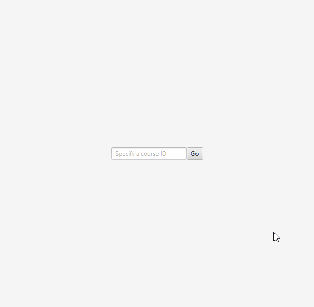

# SWE-437 :: Quiz Scheduler

The first assignment for [SWE-437](https://cs.gmu.edu/~offutt/classes/437/index.html) on Software Evolution. 

## Requirements

* [Maven](https://maven.apache.org/) - Compilation
* [Java 8](https://openjdk.java.net/projects/jdk8/) - JavaFX

## Maintainability 

The following pros & cons pertain to the _initial state_ of the software. Some of the original files were excluded from the initial commit (`Makefile`/`deploy`), but may be found in the [original assignment zip](original.zip).

**Pros:**

* Small project, easy to comprehend
    * Additional comments helped to compartmentalize logic & provide concise summaries of components
* Logic was clearly separated among classes _(front-end-servlet / utilities / beans)_

**Cons:**

* Expected type of `daysAvailable` is documented to be an `int` but is defined as `String` in the code.
* Build/deploy systems were system-dependent
    * `Makefile` did not work out-of-the-box with a fresh installation of JDK-8
        * Dependencies _(javax.servlet)_ needed to be manually specified by the user in order to compile
    * `deploy` specified system-dependent paths & required setting up [additional software](https://piazza.com/class/jqwfp37y1ap78x?cid=30) to test
* Source code format did not follow [guidelines](https://www.oracle.com/technetwork/java/javase/documentation/codeconvtoc-136057.html) consistently between classes

## Documentation log

* TODO: Summarize git history