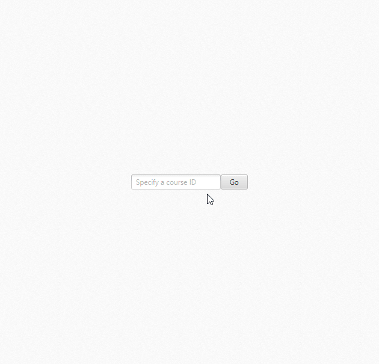

# SWE-437 :: Quiz Scheduler

The [third assignment](https://cs.gmu.edu/~offutt/classes/437/assigns/assign03.html) for [SWE-437](https://cs.gmu.edu/~offutt/classes/437/index.html) on Software Evolution. 

As a student, you can enter the class ID and click the `Go` button to register for a quiz retake. To register for a retake, select both a quiz _(green)_ and a retake session _(blue)_. Then enter your name in the textfield and click _"Register"_ to sign up for the retake. A prompt will alert you to the success of your appointment.

As a professor, you can hold `SHIFT` when clicking the `Go` button to view the staff-view. The staff view displays information in the following ways:

* Clicking a quiz will show when and where students are taking that quiz
* Clicking a retake session will show the students attending the session and which quizzes they are taking

## Requirements

* [Maven](https://maven.apache.org/) - Compilation
* [Java 8](https://openjdk.java.net/projects/jdk8/) - JavaFX

## Maintainability 

The following pros & cons pertain to the _[prior state](https://github.com/Col-E/SWE-437/tree/1.0.0)_ in relation to the current state of the software.

**Pros:**

* Balance of small architecture and abstraction allowed changes to be made easily

**Cons:**

* Schedule display connected to `StudentView`
    * Had to split up logic to account for creation of `StaffView`
    * This new super-class, `ScheduleView`, had to account for both the Student and Staff's implementations

## Documentation log

* General changes
    * The schedule display now indicates which slot is selected by darkening the color
    * Remove unused methods in `QuizBean`
    * Moved XML files to subdirectory `data`
    * Cleaner XML parsing in `IOUtils`
    * Updated XML test data
* Student UI _(Updated)_
    * Swap location of navigation-bar with form-inputs
* Staff UI _(New)_
    * Schedule display with section on top for displaying appointment information
        * Student name _(optional avatars, samples provided)_ + quiz retaken + appointment location/time
    * Clicking a quiz shows who is taking the quiz and when
    * Clicking a retake shows who is going to the session and what they are retaking